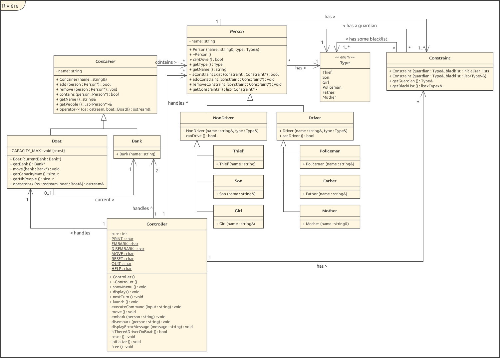

# POO2 - Labo 4 : Rivière

Auteur : David Jaquet & Christoph Rueff

## Introduction

Ce laboratoire est une version améliorée du jeu du loup, de la chèvre et du chou voulant traverser la rivière. Pour cette version, nous avons donc un père, une mère, deux fils, deux filles, un policier et un voleur. Ces 8 personnes ont différentes contraintes précisée dans la données et doivent traverser une rivière grâce à un bateau de 2 places. Ce laboratoire à faire en C++

## Schéma UML

## Implémentation

Pour approcher ce problème de manière OO, nous avons décidé d'implémenter les contraintes à l'intérieur des personnes afin de pouvoir simplement ajouter autant de contraintes que souhaité. Les contraintes se font par rapport au type de la personne et non à la personne en tant que tel afin de simplifier une contrainte du type : _Un père ne peut pas rester seul avec sa fille sans la mère_. La contrainte vérifiant le type, le père peut avoir plusieurs filles, nous n'avons besoin de créer qu'une seule fois la contrainte.